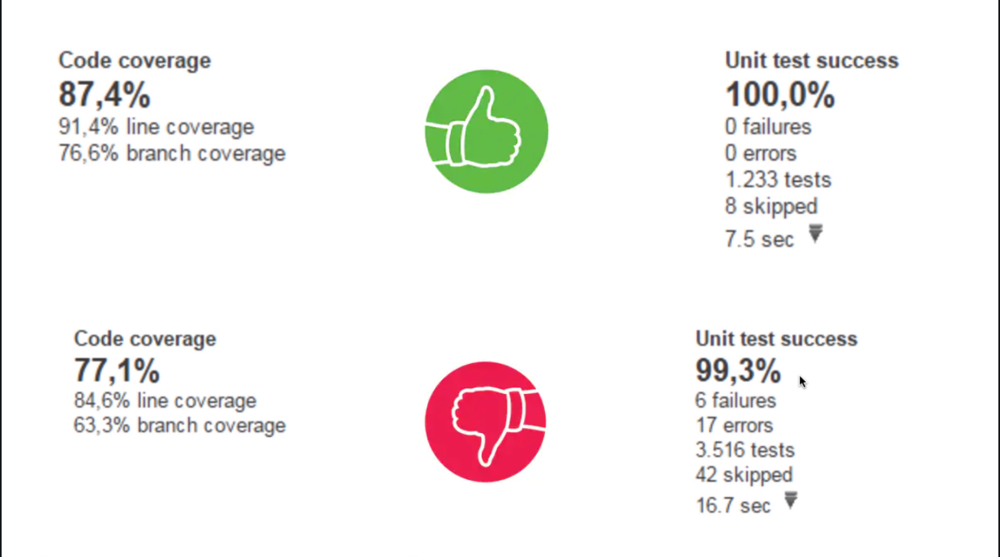

# Análise de cobetura de testes

## 1. Percentual de aceitação dos teste
Esse é bem simples é calculado no momento que rodamos os testes.

>É a quantidades de testes executados com sucesso dividido pela quantidade de testes no geral.

Essa métrica não precisamos perder muito tempo, pos se a barra de este estiver verde é por que o indice esta em 100%.

## 2. Percentual de cobertura de código

Para essa métrica precisamos de uma ferramenta extra, na IDE eclipse temos plugin chamado **EclEmma.**

### É so instalar, no final da instalação a IDE é reiniciada e aparecerá um novo botão para execução de testes. 

### Ao final gerar relatorio dos códigos que foram exercitados com essa execução.

### Note que no final da execução as linha de códigos ficaram coloridas, são três cores:

1. **Verde** &rarr; indica que a linha foi executada completamente.

2. **Amarela** &rarr; indica que a linha foi executada parcialmente. Esse tipo só ocorre quando a linha tem uma lógica e sua execução pode tomar caminhos distintos. Essas linha também são conhecidas como **Branches**.

3. **Vermelha** &rarr; indica que a linha não foi executada.

### Fora essas indicações no código ele também gera um relatório.

### A Imagem abaixo mostra resultados de testes de um determinado projeto.

